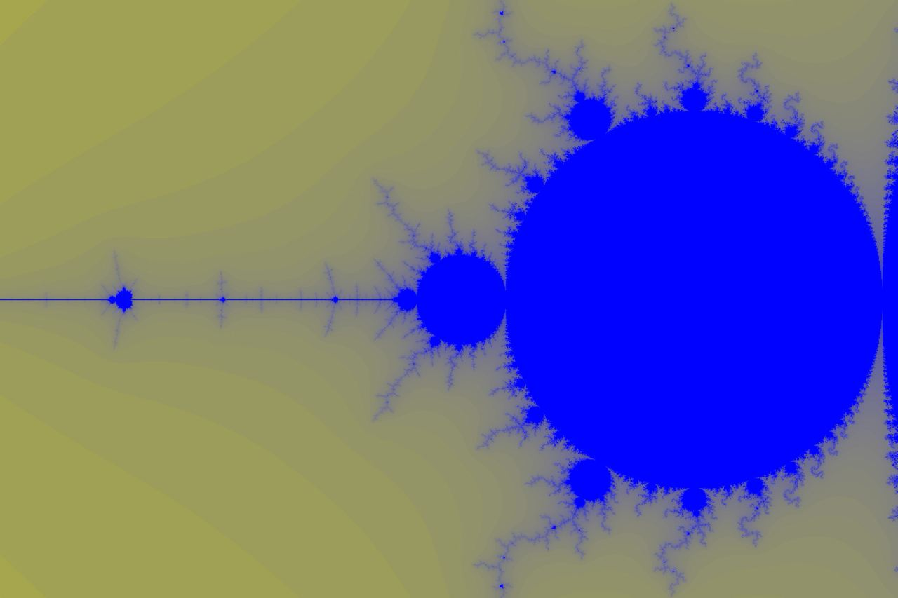

# Лабораторная работа по изучению SIMD функций

## Цель

В данной работе мы постараемся ускорить алгоритм рисования множества Мандельброта с помощью SIMD функций, в том числе мы изучим влияние разных методов оптимизаций на скорость работы трудоёмких для вычисления алгоритмов.

## Рассматриваемый алгоритм

Как пример трудозатратного для вычисления алгоритма рассмотрим [множество Мандельброта](https://ru.wikipedia.org/wiki/Множество_Мандельброта). Вкратце, визуализация данного множества задаётся следующим образом:

1. Зададим радиус некоторой окружности, внутри которой будем строить множество.
2. Теперь выберем некую точку с координатами $(x_0, y_0)$ внутри этой окружности.
3. В зависимости от координат выбранной точки, будем рассматривать следующие точки с координатами $(x_n, y_n)$, где
   $$x_n = x_{n - 1}^2 + y_{n - 1}^2 + x_0$$
   $$y_n = 2 \cdot x_{n - 1} \cdot y_{n - 1} + y_0$$.
5. Будем рассматривать такие точки до тех пор, пока $n$-ная точка не удалится на расстояние, большее чем $R_{MAX}$ (выбранное в первом пункте) от центра окружности.
6. Закрасим самую первую точку с координатами $(x_0, y_0)$ некоторым цветом, зависящим от $n$.

Таким образом мы сможем сгенерировать множество Мандельброта и вывести его визуализацию на экран:



## Описание действий

Будем сравнивать три примера реализации данного алгоритма.  

1) Простейшая версия без каких либо оптимизаций. Перебор каждой точки по очереди и последовательный рассчет её цвета.
2) Ускоренная массивами версия. Будем последовательно брать массивы нескольких точек подряд, затем так же последовательно рассчитывать цвет каждой точки внутри массива. Таким образом постараемся "намекнуть" компилятору на возможность упрощения алгоритма.
3) Быстрая версия с использованием AVX инструкций.

Для получения какого-либо результата нам придется сравнивать времена работы для трёх программ. Достаточно точным способом будет использование ассемблерной команды ```rdtsc```, которая возвращает в регистрах ```EDX:EAX``` такт процессора. Напишем функцию на ассемблере, которая будет возвращать такт процессора. Будем считать разницу тактов между началом вычислений Мандельброта и его концом. Таким образом получим время работы алгоритма в своеобразной единице измерения (тактах). Сравнивая эти такты мы сможем делать выводы о различии скоростей при разных оптимизациях.  

Для более точных измерений будем в одной программе замерять время работы для 300 кадров, затем получать среднее количество тактов на один кадр. Будем делать запуск программы 3 раза для того, чтобы получить максимально точный результат (через МНК). После всех этих действий имеет смысл запустить программу вновь, получить контрольный результат и сравнить его с посчитанным ранее средним, сделав вывод об адекватности полученных значений. Данное измерение будем называть контрольным. 

Во всех программах будем замерять время при разных флагах оптимизации компилятора, а так же будем использовать флаг ```-mavx2```, чтобы компилятор имел возможность применять AVX инструкции для ускорения программы.

## Реализация

### Простейшая версия

Напишем реализацию с последовательным рассчетом цвета для каждой точки и сделаем измерения скорости рисования одного кадра:  

$t_i$ - время работы кадра в тактах, где $i$ это номер измерения.  
$t_{avg}$ - среднее по МНК время работы.
$t_{control}$ - контрольный замер времени.

| Оптимизация компилятора | $t_{1}$  | $t_{2}$  | $t_{3}$  | $t_{avg}$ | $t_{control}$ |
|:-----------------------:|:--------:|:--------:|:--------:|:---------:|:------------:|
|  -O3                    | 50382199 | 50533575 | 50390267 | 50435347  |  50683631    |
|  -O0                    | 98117403 | 97898647 | 98284039 | 98100029  |  98130876    |

Получили, что оптимизация компилятора ускоряет работу программы примерно в $\frac{98100029}{50435347} \approx 1.94$ раза. Результат в целом не удивителен, компилятор действительно круто оптимизирует.


### Реализация с массивами

В этом случае мы попробуем намекнуть компилятору о возможной оптимизации через AVX-инструкции. Попробуем написать аналог SIMD функций, аргументами которых станут массивы из нескольких чисел типа ```float```. Единственное отличие будет заключаться в том, что в нашей реализации вычисления будут проходить по очереди для каждой ячейки массива, в SIMD функциях такие вычисления будут проходить параллельно. Благодаря такому параллельному выполнению наша программа могла бы ускорится во столько раз, сколько чисел хранит один такой массив. Мой процессор поддерживает вектора размера 256 бит, это значит, что мы можем испольовать массивы из 8 действительных чисел (так как одно число типа ```float``` занимает 32 бита, $32 \cdot 8 = 256$). Замеряв количество тактов для одного кадра получим данные результаты:

| Оптимизация компилятора | $t_{1}$   | $t_{2}$   | $t_{3}$   | $t_{avg}$ | $t_{control}$ |
|:-----------------------:|:---------:|:---------:|:---------:|:---------:|:------------:|
|  -O3                    | 26382920  | 27258303  | 26851765  | 26830996  |  27890640    |
|  -O0                    | 406515603 | 415656116 | 415192044 | 412454587 |  422255688   |

Получаем достаточно интересный результат. При разных оптимизациях компилятора получаются совершенно разные результаты. При -O3 реализация на массивах ускоряет работу программы в $\frac{50435347}{26830996} \approx 1.88$ раз. Видимо компилятор всё же не смог заметить предлагаемой нами оптимизации. Причем он всё равно увидел некоторые варианты ускорения программы, которые не мог заметить при первом случае. Теперь рассмотрим разницу скоростей при отключенной оптимизации (-O0). В таком случае уже первая версия оказывается быстрее в $\frac{412454587}{98100029} \approx 4.2$ раза. Я могу предположить, что это связано с тем, что мы пересчитываем координаты всех точек массива пока хотя бы одна остается в круге. Рассматривая же точки по очереди мы никогда не потратим время на подсчёт новой координаты точки, итак вылетевшей из круга. Возможно это не единственная причина такого провала во времени, но на мой взгляд она одна из самых важных. Так же скорость замедляется из-за накладных расходов, связанных с вложенными циклами (мы чаще обращаемся к памяти, что тратит много времени).  

Из этого пункта можем сделать вывод, что "подсказки" компилятору о том, какие инструкции следует использовать, не дают значимого результата. Более того, успешность оптимизации будет сильно зависить от флагов компилятора. В нашем случае при флаге -O0 программа стала работать намного медленнее.

### SIMD инструкции

Теперь же мы можем реализовать алгоритм через instrinsic функции. Фактически всё что нам требуется поменять в предыдущей программе, это заменить массивы нескольких чисел на переменные типа ```__m256```. Эти переменные мы так же будем рассматривать как массивы, а в каждых 8-ми битах одной такой переменной будут подсчитываться данные для независимых точек множества. Замеряем время для такой реализации:

| Оптимизация компилятора | $t_{1}$   | $t_{2}$   | $t_{3}$   | $t_{avg}$ | $t_{control}$ |
|:-----------------------:|:---------:|:---------:|:---------:|:---------:|:------------:|
|  -O3                    | 10078038  | 10051705  | 10018111  | 10049284  |  10292526    |
|  -O0                    | 33861935  | 33916503  | 33827301  | 33868579  |  33894652    |

Из полученных результатов можем сделать вывод, что SIMD инструкции ускоряют работу программы в $\frac{50435347}{10049284} \approx 5.01$ раз. 


Это меньше, чем ожидалось, ведь одна переменная типа ```__m256``` позволяет выполнять действия над 8 точками одновременно. Но в любом случае мы обогнали оптимизацию компилятора для первого случая, это очень круто. Почему же программа ускорилась лишь в 5 раз? Я предполагаю что это опять же связано с тем, что мы посчитаем некоторое лишнее количество координат для точек, которые итак уже не попадают в рассматриваемый нами круг. Эти точки будут рассчитываться и в дальнейшем лишь из-за того, что хранятся в одной переменной с другой точкой, которая находится внутри круга.

## Вывод

Подводя итоги данной работы можем сделать пару выводов:

1) SIMD инструкции действительно сильно ускоряют работу программ. Способность вычислять параллельно несколько координат вносит большую роль в оптимизации.
2) Не имеет смысла "подсказывать" компилятору возможность опитмизации, лучше реализовать её самостоятельно. На нашем примере из второй реализации программы, компилятор бесспорно смог заметить больше оптимизаций чем в самом первом варианте, но всё же не смог настолько ускорить программу, как в третьем случае, где мы сами использовали SIMD инструкции.


